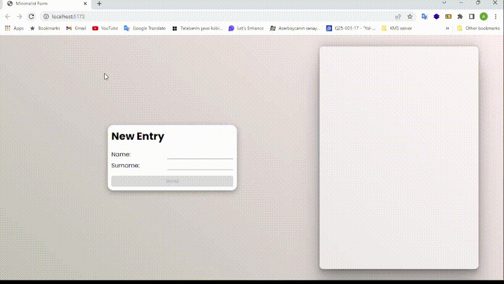

## Minimalist-Form

Minimalist-Form is a simple project that allows users to enter their name and surname in a form. It also displays notes associated with the entered name and surname, which are fetched from a JSON-Server using Axios GET and POST actions. The project is built using Vite.js for React.js.
## Screenshots


### Installation

To run the Minimalist-Form project, please follow these steps:

1. Clone the repository:

   ```shell
   git clone https://github.com/valiyev000/Minimalist-Form.git
   ```

2. Navigate to the project directory:

   ```shell
   cd Minimalist-Form
   ```

3. Install the project dependencies:

   ```shell
   npm install
   ```

4. Start the JSON-Server:

   ```shell
   npm run json-server
   ```

   This will start the JSON-Server and provide the necessary data for the form.

5. In a new terminal window, start the Vite development server:

   ```shell
   npm run dev
   ```

   This command will start the Vite development server and open the project in your default web browser.

### Usage

Once the installation is complete and the development server is running, you can access the Minimalist-Form project in your web browser.

1. Enter your name and surname in the provided text input boxes.
2. Click the "Submit" button to save your data and display associated notes.

### Additional Notes

- Make sure you have Node.js installed on your system before proceeding with the installation.
- The project uses npm as the package manager. If you prefer using Yarn, you can replace the `npm` commands with the corresponding `yarn` commands.
- If you encounter any issues or errors during the installation or usage, please refer to the project's issue tracker on GitHub for troubleshooting or contact the project maintainer for assistance.

That's it! You should now have the Minimalist-Form project installed and running successfully. Feel free to explore and modify the project as needed.
